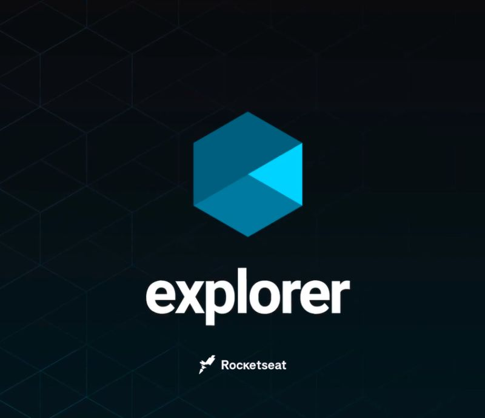

<h1 align="center">Desenvolvimento Full-Stack </h1>

###

  
  
          
  
  
  
   
  
                                     

 
### <a  href="https://github.com/BeatrizGivisiez/rocketseat-explorer/tree/master/Stage01"> Stage 01 - Fundamentos da programação WEB. </a>

 

### <a  href="https://github.com/BeatrizGivisiez/rocketseat-explorer/tree/main/Stage02"> Stage 02 - Conceitos HTML5 e CSS3. </a>

<a href="https://rocketseat-explorer.vercel.app/"> 🚀 Desafio 1 - Corrigindo bugs 01 </a> | [Notion](https://efficient-sloth-d85.notion.site/Iniciante-Corrigindo-bugs-01-b448368a774c4badae1964ab414f5272)   
<a href="https://rocketseat-explorer-bug02.vercel.app/"> 🚀 Desafio 2 - Corrigindo bugs 02 </a> | [Notion](https://efficient-sloth-d85.notion.site/Iniciante-Corrigindo-bugs-02-300452b6901e4197b7c6fd291a280acf)  
<a href="https://rocketseat-explorer-bug02.vercel.app/"> 🚀  Desafio 3 - Semântica e acessibilidade  </a> | [Notion](https://efficient-sloth-d85.notion.site/Intermedi-rio-Sem-ntica-e-acessibilidade-849b1ec224c349e3854a20aed395a45f) 
<a href="https://rocketseat-explorer-stage2-desafio.vercel.app/"> 🚀 Desafio 4 - Recriando layout</a> | [Notion](https://efficient-sloth-d85.notion.site/Desafio-avan-ado-Recriando-layout-17338681d78c439aa64ac9474d7c6d92)  

## Stage 03
