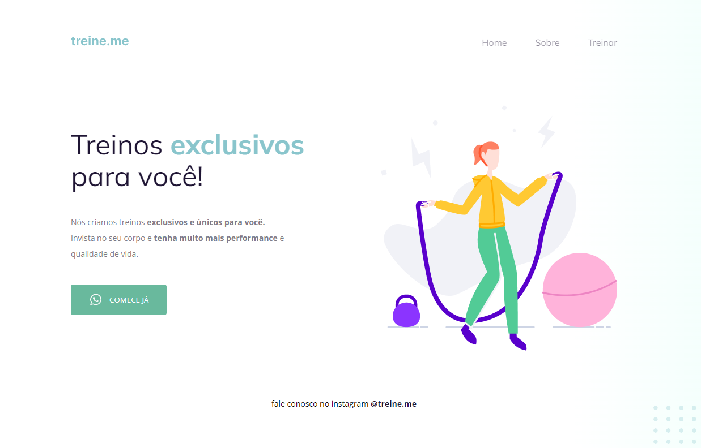

<h1 align="center">Desafio 02 - Bug 02</h1>

  
  

---

Nesse desafio, você receberá um código com o projeto desenvolvido durante as aulas da Fase 02. E, novamente, a surpresa (não tão surpresa assim) vem aí...  👀  O código sofreu algumas alterações nos principais pontos abordados nessa fase e, como podemos ver na imagem abaixo, ele não está mais da mesma forma que o Maykão deixou.Topa encarar esse desafio e deixar o site com a mesma carinha de antes? 💜 Vai ser muito importante para o seu aprendizado rever e aplicar esses novos conceitos. Lembrando: tente se desafiar e não olhar a resposta mas, caso apareça alguma dificuldade, você pode voltar nas aulas e rever a maneira com que foi desenvolvido!

- 🚀 Link do [Notion](https://efficient-sloth-d85.notion.site/Iniciante-Corrigindo-bugs-02-300452b6901e4197b7c6fd291a280acf). 
- 🚀 Link do [Figma](https://www.figma.com/file/rkDOHGPwwFtBNqEdHSuQPd/Projeto-02---Explorer?node-id=0%3A1). 
- 🚀 Link do [Deploy](https://rocketseat-explorer-bug02.vercel.app/). 

---

## Contato

Feito por [Beatriz Givisiez](https://github.com/BeatrizGivisiez)!

&nbsp;