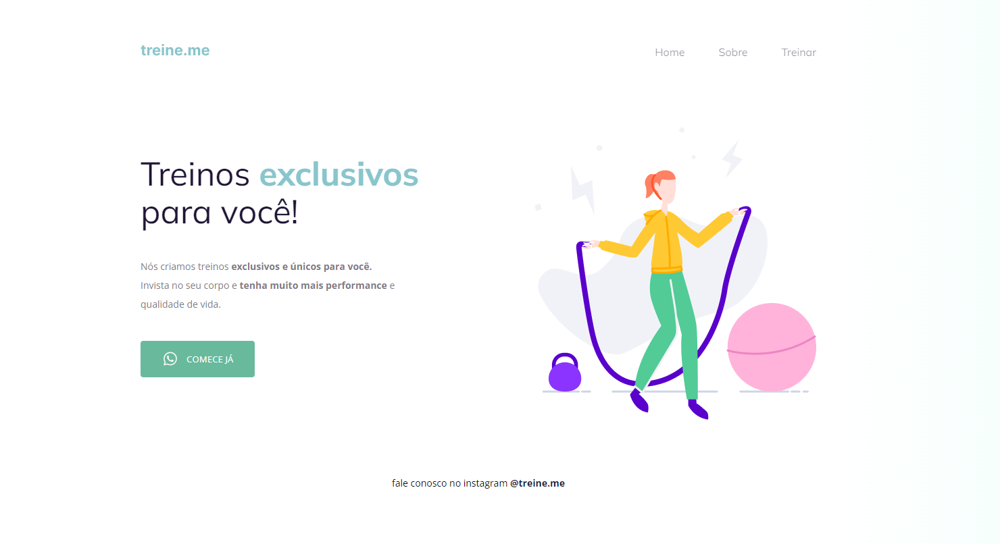

# 💻 Desafio - Semântica e acessibilidade.

Sabemos que a maior parte do conteúdo disponível na internet hoje pode se tornar acessível apenas com a utilização correta dos elementos do HTML.

Você receberá um código com o projeto desenvolvido durante a Fase 02, mas, ao contrário do que foi feito em aula, ele não apresenta a semântica correta. Como você pode ver na imagem abaixo, a página (exceto o botão) continua funcionando normalmente mas, quando você abrir o código, vai se deparar com os elementos do HTML todos bagunçados... 👀

<h2 align="center"> Para fazer o desafio usei 👇</h2>

  
  

 

- 🚀 Link do [Notion](https://efficient-sloth-d85.notion.site/Iniciante-Corrigindo-bugs-02-300452b6901e4197b7c6fd291a280acf). 
- 🚀 Link do [Figma](https://www.figma.com/file/rkDOHGPwwFtBNqEdHSuQPd/Projeto-02---Explorer?node-id=0%3A1). 
- 🚀 Link do [Deploy](https://rocketseat-explorer-bug02.vercel.app/). 

---

## Contato

Feito por [Beatriz Givisiez](https://github.com/BeatrizGivisiez)!

&nbsp;
