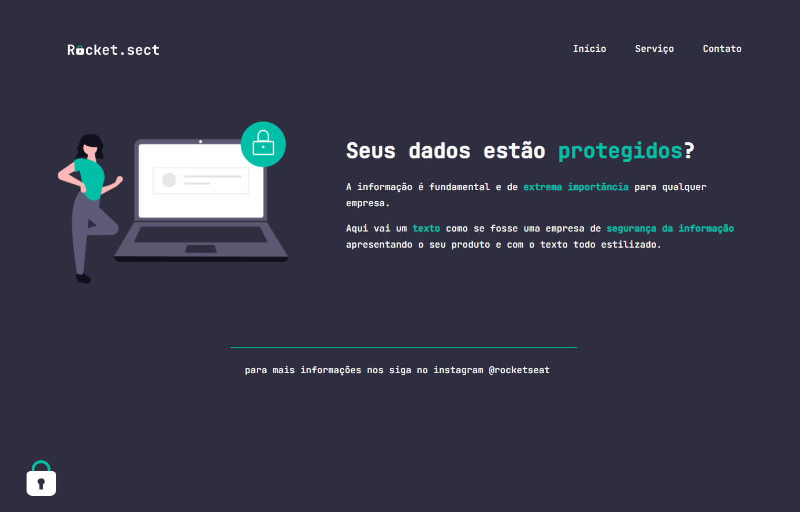

# 💻 Desafio - Recriando Layout.

Nesse desafio, você deverá recriar uma aplicação, a partir de um layout, para treinar o que aprendeu até agora no Stage 02.

<h2 align="center"> Para fazer o desafio usei 👇</h2>

  
  

 

- 🚀 Link do [Notion](https://efficient-sloth-d85.notion.site/Desafio-avan-ado-Recriando-layout-17338681d78c439aa64ac9474d7c6d92). 
- 🚀 Link do [Figma](https://www.figma.com/file/MEn6prcRm1jWLmP9BaXu4B/Explorer-(Copy)?node-id=0%3A1). 
- 🚀 Link do [Deploy](href="https://rocketseat-explorer-stage2-desafio.vercel.app/). 

---

## Contato

Feito por [Beatriz Givisiez](https://github.com/BeatrizGivisiez)!

&nbsp;
